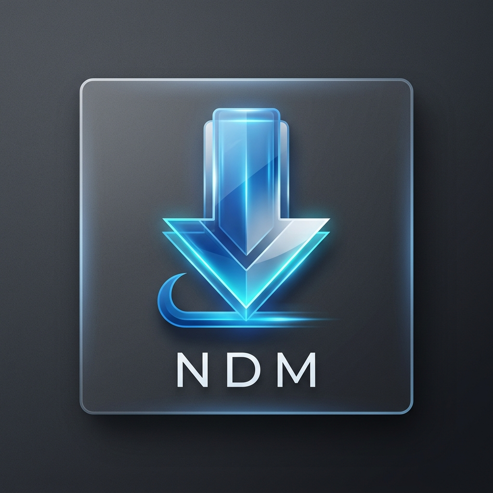

# 🚀 Nusantara Download Manager (NDM)

**Nusantara Download Manager (NDM)** is a high-performance, modular download manager built with Python. Designed for modern users who value speed, portability, and aesthetics, NDM leverages a multi-threaded engine to maximize your bandwidth potential.



---

## ✨ Features

### ⚡ Performance & Core
- **Multi-threaded Downloads**: Breaks files into multiple segments and downloads them concurrently for up to 5x speed boost.
- **Resume Support**: Smart pause and resume capabilities for interrupted downloads, saving your progress automatically.
- **Low Resource Usage**: Optimized for background operation without slowing down your system.

### 🎨 UI & Customization
- **Premium Aesthetics**: Crafted with `CustomTkinter` featuring a dark mode, vibrant blue accents, and **SemiBold Poppins** typography.
- **Modern Layout**: Responsive sidebar navigation with dedicated pages for Active, Finished, and Failed downloads.
- **Real-time Stats**: Live monitoring of download speeds, ETA, file size, and network connectivity.

### 🍱 Portability & Integration
- **True Portable Mode**: Detects if it's running as a portable build and automatically stores all settings, history, and database within the local folder.
- **Browser Integration**: Official Chrome extension support via a local server (Port 5555) for instant link capturing.
- **Global i18n**: Fully localized in **English** and **Bahasa Indonesia** with instant UI refresh upon switching.
- **System Tray Support**: Minimizes to the notification area to keep your desktop clean while downloads continue.

---

## 🛠️ Technology Stack

- **GUI**: [CustomTkinter](https://github.com/TomSchimansky/CustomTkinter) (UI Framework)
- **Engine**: Python Standard Library (`threading`, `requests`, `socket`)
- **Persistence**: SQLite3 (History & Settings)
- **Imaging**: Pillow (PIL)
- **Desktop**: Pystray (System Tray), Winreg (Boot Integration)

---

## 🏗️ Installation & Build

### Prerequisites
- Python 3.10 or higher
- Windows 10/11 (Preferred for full WinAPI features)

### Development Setup
1. Clone the repository:
   ```bash
   git clone https://github.com/posann/ndm-nightly.git
   cd ndm-nightly
   ```
2. Install dependencies:
   ```bash
   pip install customtkinter pillow pystray requests
   ```
3. Run the application:
   ```bash
   python app.py
   ```

### Building Distribution (PyInstaller)
NDM includes a dedicated build script `build_ndm.py` to simplify the creation of executables.

#### 1. Portable Version (`NDM-Portable.exe`)
Builds a single, self-contained executable that keeps all data locally.
```bash
python build_ndm.py portable
```

#### 2. Installer Source (`dist/NDM/`)
Builds a directory-based version suitable for packaging into an installer or standard distribution.
```bash
python build_ndm.py installer
```

---

## 📥 Browser Integration Setup

To get NDM working with your browser:
1. Open the **Integration** page in the NDM app.
2. Drag the extension card directly into your Chrome Extensions page (`chrome://extensions/`) or copy the extension path provided and use "Load unpacked".
3. Ensure the server status shows **● Server Active (Port 5555)**.
4. Click the NDM icon in your browser to send links directly to the manager.

---

## 🧪 Testing

### Verification Procedures
- **Localization Test**: Go to Settings, change the language to "Bahasa Indonesia", and verify that the sidebar and all pages update instantly without restart.
- **Portability Test**: Run the portable build and check if `downloads.db` appears in the same folder as the `.exe`.
- **Download Integrity**: Perform a multi-segment download and verify the file merges correctly (check 'Logging' page for completion events).

### Unit Testing
Run specialized feature tests:
```bash
python test_drag.py  # Tests the native shell drag integration
```

---

## 📁 Project Structure

| Directory | Description |
| :--- | :--- |
| `core/` | Hard-core download logic, segments manager, and local server. |
| `ui/` | All UI pages (Downloads, Browser, Settings) and custom components. |
| `utils/` | Shared utilities like localization engine, database helpers, and font loaders. |
| `localization/` | Multi-language translation files (JSON). |
| `fonts/` | Premium typography assets. |
| `extension/` | Browser extension source files. |

---

## 📜 License

Maintained by **posann**. All rights reserved.

---

_Crafted with ❤️ in Nusantara._
